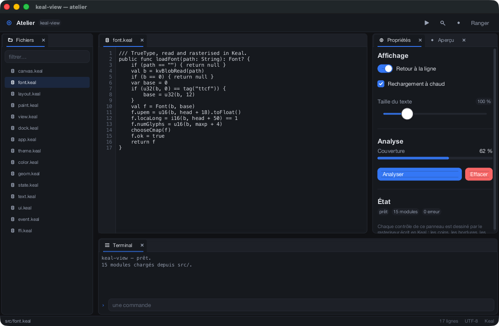
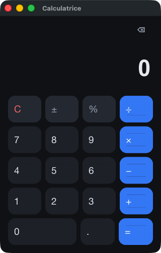
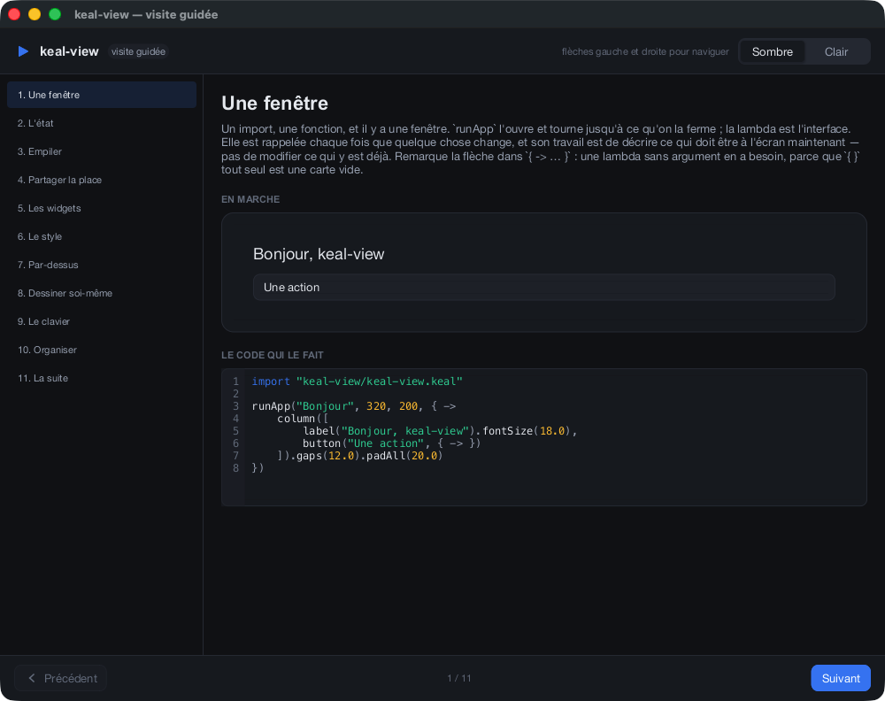
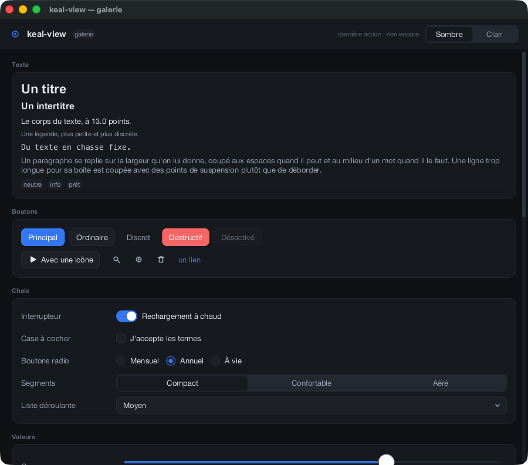

# keal-view — application windows, written in Keal

A cross-platform GUI framework for [Keal](https://github.com/geneacta/keal),
in which **the drawing is Keal**. Not bindings to a toolkit, not a wrapper
round a C canvas: the rasteriser, the TrueType engine, the layout, the
widgets, the theme and the docking are all `.keal` files. The C underneath
opens a window, reports what the user did, and puts a finished buffer of
pixels on the screen. It does not draw anything.

```
              lines    what it is
  Keal         5479   the whole framework: rasteriser, fonts, layout,
                       widgets, theme, docking, menus, the run loop
  C              690   one window, one event queue, and inline accessors
                       (kv.h, plus one backend of three)
```

**89 % of a running keal-view program is Keal**, and none of the other 11 %
puts a pixel anywhere.

<p align="center"></p>

*Every pixel above — the rounded corners, the anti-aliased borders, the
shadows, the glyphs — came out of a loop written in Keal.*

## Why that is even possible

One fact about the compiler decides the whole design. `native """..."""`
pastes its C into **the same translation unit** as the compiled program, so a
`static inline` function declared there is inlined into Keal's own code by the
C compiler. A call across the boundary is not a call — it is the instruction
it contains.

```keal
extern func kvPxSet(x: Int, y: Int, argb: Int): Int = "kv_set"
```

That is one bounds-checked store. Measured at about half a nanosecond per
pixel from a Keal loop, which is what a C rasteriser costs, because after
inlining it *is* the C rasteriser. So there was no reason to write the drawing
in C, and every reason not to.

The whole C surface is [`runtime/kv.h`](runtime/kv.h): a framebuffer, a byte
blob, an event struct, and accessors for each. Everything else is Keal.

## Hello

```keal
import "keal-view/keal-view.keal"

val clicks = state(0)

runApp("Hello", 320, 200, { ->
    column([
        label("Clicked ${clicks.get()} times").fontSize(20.0).centered(),
        button("Click me", { -> clicks.set(clicks.get() + 1) }).kindOf(primary)
    ]).gaps(12.0).padAll(24.0).aligned(mainCenter, crossCenter).grows()
})
```

```sh
tools/build.sh hello.keal && build/hello
```

An application is a function from its state to a tree of views. Writing a
`Cell` is what says the frame is stale; nothing calls repaint by hand. The
tree is thrown away and made again — there is no diff, and so nothing to
forget to invalidate.

## A calculator

<p align="center"></p>

[`examples/calculator.keal`](examples/calculator.keal) is the whole thing end
to end — arithmetic, keypad, keyboard — in about 200 lines. The keypad is
five rows of four:

```keal
func digitKey(d: String): View {
    return key(d, plain, { -> typeDigit(d) }).bg(t.surfaceHi)
}

func keypad(): View {
    return column([
        row([funcKey("C", …), funcKey("±", …), funcKey("%", …), opKey("÷")]).grows(),
        row([digitKey("7"), digitKey("8"), digitKey("9"), opKey("×")]).grows(),
        …
    ]).gaps(8.0).padAll(16.0).grows()
}
```

## Docking

[`examples/studio.keal`](examples/studio.keal) is the picture at the top. The
arrangement is a binary tree of exactly two cases — a **leaf** holding tabs,
and a **split** holding two children with a fraction — which is few enough
that every arrangement it can be in is one you can reason about:

```keal
val dock = Dock(
    beside(
        leaf(["files"]),
        above(
            beside(leaf(["editor"]), leaf(["props", "preview"]), 0.68),
            leaf(["terminal"]),
            0.72),
        0.19))

dock.add(panelOf("files", "Files", { -> filesPanel() }))
```

A panel is dragged by its tab; while it is moving, the highlight under the
pointer says where letting go would put it — left, right, above, below, or as
another tab — *before* it is let go. Dividers are dragged. Tabs close. A panel
is an ordinary view function and does not know it is docked.

## Documentation

* **[`examples/tour.keal`](examples/tour.keal)** — a guided tour of keal-view,
  written in keal-view. Eleven chapters, each showing a thing **running** next
  to the code that made it: a live counter, a live slider, a live dock you can
  drag a panel around inside. Start here.

  ```sh
  tools/build.sh examples/tour.keal && build/tour
  ```

* **[The guide](docs/guide.md)** — the same ground in prose, in the order you
  need it: a window, state, layout, widgets, style, menus, drawing your own,
  the keyboard, docking.
* **[The reference](docs/widgets.md)** — every constructor, modifier, theme
  field and canvas call, on one page.
* **[`examples/gallery.keal`](examples/gallery.keal)** — documentation that
  runs: every widget there is, on one scrolling page. If a control is not in
  there it does not exist.

<p align="center"></p>

<p align="center"></p>

## What is in it

**Widgets.** `label` `heading` `title` `caption` `paragraph` `badge` `icon`
`link` `banner` · `button` `iconButton` `menuButton` `checkbox` `radio`
`toggle` `segmented` `select` `slider` `stepper` `progress` `field`
`secretField` `tabs` `tabView` · `card` `panel` `scroll` `divider` `spacer` —
and `custom`, which is handed a clipped canvas, its rectangle, the fonts, the
theme and its own hover state, and may draw anything. The editor and the chart
in the first picture are two of those.

**Menus, dialogs and tooltips.** `openMenu`, `openDialog`, `openSheet` and
`.tip("…")`. Nothing has to be installed: the run loop composes that layer
above the application's own overlay, so `openMenu` works in a program that has
never heard of it.

**Layout.** One axis of flexbox and no more: children stack along the
container's axis, whatever is left over is shared among those that said
`grows()`, and across the other axis a child stretches or aligns. `stack`
lays children one on another; `.shares()` divides the room in exact
proportion; `.at(x, y)` places one absolutely. There is no shrinking —
content that does not fit is clipped rather than squeezed, because a layout
that silently compresses fails only on small windows, which is the last place
anyone looks.

**Text.** A TrueType parser and rasteriser in Keal: the table directory,
`cmap` formats 0, 4, 6 and 12, `loca`, `glyf` including composite glyphs,
`hmtx`, and TrueType Collections. Glyphs are filled by the signed-area method
— one accumulation pass, one running sum, exact anti-aliasing, nothing
supersampled — cached per size, and rasterised at the size they will actually
be drawn, so a Retina screen gets a Retina glyph rather than a stretched one.
Measuring, wrapping, ellipsising and hit-testing a caret are all there.

**Drawing.** Anti-aliasing is analytic, not sampled: a straight edge's
coverage is its exact overlap with the pixel cell, a curved edge's is the
distance from the pixel centre. There is no quality dial and no frame that is
quietly cheaper than the last. Rounded rectangles are three bands and four
arcs, so the distance function only ever runs inside four radius-square
boxes, however large the rectangle. Shadows, gradients, strokes, clipping and
circles come from the same twenty-odd loops.

**Theme.** Dark and light, built from one surface ramp, one accent and three
status hues rather than a list of hex codes. There is one theme in force and
everything reads it, so `useTheme(lightTheme())` is the whole change — and no
widget hard-codes a colour or a corner, including widgets written afterwards.

**Everything measures in points.** The rasteriser is the only thing that
knows what a pixel is. One layout is correct on a Retina display and a
projector; the numbers never change, the scale does.

## Running it

Keal-view needs the Keal compiler beside it:

```sh
git clone https://github.com/geneacta/keal
git clone https://github.com/geneacta/keal-view
cd keal && cargo build --release && cd ../keal-view

tools/build.sh examples/tour.keal       && build/tour         # start here
tools/build.sh examples/gallery.keal    && build/gallery      # every widget
tools/build.sh examples/calculator.keal && build/calculator
tools/build.sh examples/studio.keal     && build/studio
tools/test.sh                                    # 194 checks, no display
```

`tools/build.sh` picks this platform's backend, compiles it once, and hands
the object file to `keal build`. That is all it does; there is no build
system here.

Two things every keal-view program understands for free:

```sh
build/studio --snapshot frame.bmp 2          # draw one frame to a file and exit
build/studio --snapshot frame.bmp 2 900 1900 # …at a size of your choosing
build/studio --window-id /tmp/id             # write its own window number out
```

The first needs no display at all, which is how the framework is checked in
continuous integration and how the pictures above were made.
`tools/shot.sh build/studio out.png` uses the second to photograph a running
window without capturing anything else on the screen.

## Platforms

| | | |
|---|---|---|
| macOS | `runtime/kv_cocoa.m` | Cocoa. **Verified** — developed here |
| Windows | `runtime/kv_win32.c` | Win32 and a BI_RGB DIB. **Verified** on Windows 10 22H2 (19045) and Windows 11 22H2 (22621), MinGW-w64 |
| Linux | `runtime/kv_x11.c` | Xlib only, no toolkit. **Verified** on Ubuntu 26.04 **aarch64**, under Wayland through XWayland |

All three were written against the same dozen functions, and nothing above
`runtime/` changed to add the second and third — which is the point of having
drawn the boundary where it is.

Windows and Linux were each verified by someone on a real machine, going
through [`docs/porting-test.md`](docs/porting-test.md) line by line, and
between them it cost nineteen defects — **twelve of which were above the
backend** and so were on every platform including the one this was written
on. A
tooltip on a plain label never appeared. Changing the theme left the previous
frame's ink, permanently, because a window at rest is not woken. Two
keystrokes in three were lost above a certain typing speed. A blinking caret
repainted the whole window sixteen times a second. A double click selected
from the start of the word to the pointer. And the loop redrew on every
wake-up whether or not anything had changed, which on Windows fed itself into
holding a whole core and everywhere else merely cost battery.

None of those could have been found by the test suite as it stood, and two of
them were being *hidden* by it: the assertions patched the state up between
events by hand, which is the rebuild the loop does, so they tested a world
that had already caught up.

That is not an argument against the suite, and the Windows tester was right to
say so. A person at a machine sees one screen, one keyboard layout and one way
of injecting events, and proves nothing about what they did not look at; the
176 assertions run tomorrow, on every platform, without anybody. What the
week actually showed is narrower and more useful: **a test that arranges the
world for the code will pass whatever the code does.** The fix was to make the
test call `deliver` — the thing the run loop calls — rather than a convenient
sequence of its parts.

Display scaling is the one thing still short of a full answer, and it is worth
saying exactly how short. Both Windows testers had screens at 100 %, and
changing someone's display settings is not a tester's call to make. But the
mechanism was checked from outside the process on a live window:
`AreDpiAwarenessContextsEqual` says the window really is
`PER_MONITOR_AWARE_V2`, so `SetProcessDpiAwarenessContext` is taking effect
rather than failing silently — which was the failure mode worth fearing. What
remains is one pair of eyes on a screen at 125 % or more, confirming that
everything is larger and still sharp.

Three things remain unverified, and they are recorded rather than glossed:
display scaling **as it looks** on Windows (both testers had screens at 100 %
and changing someone's display settings is not a tester's call), tearing
during a fast resize (repeated screen capture tops out near sixty milliseconds
and a tear lives inside one frame), and the pointer's *shape* under XWayland,
where the compositor decides and a control window written the same way fails
the same way.

The framebuffer format is the same on all three — `0xAARRGGBB` in a
`uint32_t` — because that is what CoreGraphics, a 32-bit BI_RGB DIB and an
X11 TrueColor visual all read on a little-endian machine. Nothing converts.

## How it is put together

```
runtime/
  kv.h            the whole C surface: framebuffer, blob, event, accessors —
                  every hot one `static inline`, and so inlined into Keal
  kv_cocoa.m      macOS: NSWindow, a layer-backed view, a ring of events
  kv_win32.c      Windows: the same, through Win32 and GDI
  kv_x11.c        Linux: the same, through Xlib alone
src/
  ffi.keal        the only file in keal-view that mentions C
  color.keal      colour packed in an Int — a record is a counted reference,
                  and this is the per-pixel loop
  geom.keal       rectangles, insets, and the cell-coverage function every
                  anti-aliased edge is made of
  canvas.keal     the rasteriser
  font.keal       TrueType, parsed and rasterised
  text.keal       measuring, wrapping, ellipsising, caret hit-testing
  theme.keal      the palettes, the metrics, and `Paint`
  view.keal       the tree an application describes
  layout.keal     measuring it and giving every node a rectangle
  paint.keal      every widget's appearance, and icons drawn from strokes
  ui.keal         what outlives a tree rebuilt every frame: hover, focus,
                  scroll offsets, carets, keyed by identity
  event.keal      what happened, in points
  state.keal      `Cell<T>` and one revision counter
  dock.keal       splits, tabs, and dragging a panel between them
  popup.keal      menus, dialogs and tooltips — things that appear over an
                  interface rather than in it, so calls rather than nodes
  app.keal        the loop, and how input gets back to the application
```

A frame is: build the tree from the state, lay it out, hand it the events that
arrived, and — if a handler changed anything — build and lay it out once more
before drawing. Dispatching against a fresh layout rather than the last
frame's is what keeps a click landing on what was under the pointer when it
happened, even on the frame where the window was resized.

Between frames the loop is inside `kvWait`, which blocks until the system has
something to say. **An idle keal-view window uses no processor at all** — not
a low duty cycle, none — and on a laptop that is worth more than any amount
of drawing speed.

That sentence sat in this README for two days before anyone measured it, and
when someone did it was false on Windows: with the pointer resting anywhere
over the window, the wait returned instantly for ever and the process held
96 % of a core. `MWMO_INPUTAVAILABLE` returns for input that has already been
seen, `QS_ALLINPUT` includes mouse movement, and Windows holds that bit while
the cursor is over the window — so a cursor that never moved kept waking a
wait with nothing to collect. It is fixed, and
[`docs/porting-test.md`](docs/porting-test.md) now asks for the measurement
twice, because the case with the pointer away was perfect throughout.

## What the language decided, and what the language changed

One place where keal-view's shape is chosen by Keal rather than by the design:

* **A tagged class instead of a widget per kind.** A trait is not a type in
  Keal, so a `List<Widget>` of different implementations cannot exist. One
  `View` class with a `kind` is what the language offers. The constructors and
  the chained modifiers are the real interface, and nothing outside
  [`view.keal`](src/view.keal) sets `kind` by hand.

There were four more. Building this framework was the first real use anything
had made of several corners of the compiler, and it found things:

* **A call whose callee is a field of function type** panicked the C backend
  when it had arguments, and emitted a call to a method that does not exist
  when it had none. Every handler in keal-view is exactly that call.
* **A local did not shadow an imported function of the same name** inside a
  function body — the backend asked "is this name a global function?" without
  asking whether something nearer was bound, and emitted a direct call over
  the binding in scope. Here it was `val over = app.overlay` against
  `over(dst, src, cov)` in the colour module: two entirely reasonable senses
  of one short word, three files apart.
* **A lambda could not capture a top-level binding**, which is exactly the
  shape a declarative interface pushes you towards — `button("+1", { ->
  count.set(count.get() + 1) })` is the natural line to write.
* **`Int` had no bitwise operators, and the boundary could not say `void`.**
  Colours were packed with `*` and unpacked with `/` and `%`; the TrueType
  flag tests were divisions where they should have been masks; and thirty C
  functions returning nothing each had to lie about returning an `Int`.

All four are fixed upstream, and this repository has been rewritten to suit:
handlers are called directly, lambdas read the cells where they stand,
`extern proc` says `void`, and `color.keal` and `font.keal` are written in
`shl`, `bor` and `band` with `0x` literals. Keal also grew hex and binary
literals with `_` separators on the way, which a TrueType parser needs rather
more than it needs shifts.

One correction to something this README said before, because it was wrong and
it was the worst of the four if it had been true: the shadowing bug did **not**
let an arity error through `keal check`. The checker resolved the name to the
local and typed it correctly; only the backend disagreed. `keal types` said so
all along, and I had not looked.

And one measurement, since it is the sort of thing that gets assumed: moving
the whole colour module from `/` and `%` to `shr` and `band` changed the
compositing loop by **nothing at all** — 3.59 ns per pixel before, 3.60 after,
same checksum ([`bench/blend.keal`](bench/blend.keal)). Every divisor had been
a literal power of two, and the C compiler had been folding them into shifts
the whole time. The operators bought clarity, not speed, which is a good enough
reason on its own and not the reason I asked for them.

## What is not here yet

Menus and dialogs (the `stack` and `.at()` they need exist; the widgets do
not) · multiple OS windows · a floating panel torn off a dock into a window of
its own · text selection across lines · right-to-left and complex scripts —
the font engine maps codepoints to glyphs one at a time, which is honest for
Latin, Greek and Cyrillic and wrong for Arabic and Devanagari · `CFF ` outlines,
so an OpenType font with cubic curves loads and reports that it has none ·
saving and restoring a dock arrangement · animation beyond a blinking caret ·
images.

## Taking part

The tests run without a display: `tools/test.sh` builds everything and asserts
131 things about colour, geometry, layout, docking surgery, fonts, state and
input dispatch. Add to them before adding to the framework.

`docs/` holds the pictures, made by `tools/shot.sh` from the programs
themselves. If you change how something looks, remake them.

The documentation here is in English to match
[keal](https://github.com/geneacta/keal); the examples' own interfaces are in
French, because that is the language of the person they were written for.

## License

Apache 2.0 — see [LICENSE](LICENSE).
